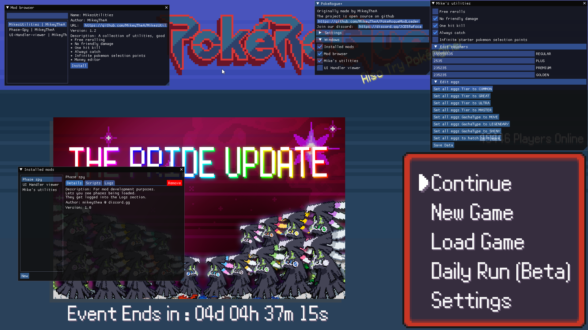
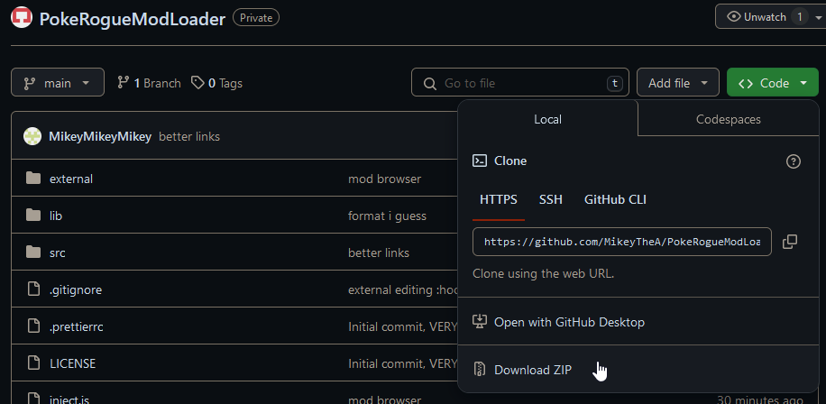

# PokeRogueModLoader
  

Mod loader for PokeRogue.net in the form of a browser extension.

Join our [Discord](https://discord.com/invite/M8suCFtF7c) for updates and help

We also have a [Youtube tutorial](https://www.youtube.com/watch?v=L7SLeEB_W7I)

# Usage

For installing the mod loader

## Prerequisites

* A browser capable of handling extensions (preferrably firefox, as it is what it has been tested on)

## Installation

Either
1. Download the repository as a ZIP file

	1.1 

	1.2 Extract the zip somewhere memorable
2. Clone the repository

	You need git installed for this

	`git clone https://github.com/MikeyTheA/PokeRogueModLoader.git`

Then, load the extension depending on your browser

### Firefox

1. Go to [about:debugging#/runtime/this-firefox](about:debugging#/runtime/this-firefox)
2. Click on "Load Temporary Add-on..."
3. Select the manifest.json from where you cloned or extracted the repository
4. Load up PokeRogue.net and the mod manager should pop up
5. Remember that you will have to re-do this every time you restart the browser
6. (If you have issues) go to pokerogue.net, then go to your addons popup menu from the puzzle piece next to your URL bar, find the loaded extension, right click it, and press "Always allow on Pokerogue.net"

### Edge

1. Go to [edge://extensions/](edge://extensions/)
2. Press "Load unpacked"
3. Select the folder where you extracted the mod loader with the manifest.json
4. Load up PokeRogue.net and the mod manager should pop up

### Other browsers

Other browsers to be added, you can still attempt to load them, however nothing else has been officially tested.

### Updating

If you downloaded it as a zip, just do it the same way by download it, deleting the old files and extracting into the same folder.

If you used git clone, cd into the directory where you cloned it, and `git pull`

### For mod developers

You can find the wiki [here](https://github.com/MikeyTheA/PokeRogueModLoader/wiki)

### Frequently asked questions

Q: The UI is blurry, what do I do?

A: Resize your browser for a second and it should adjust the resolution